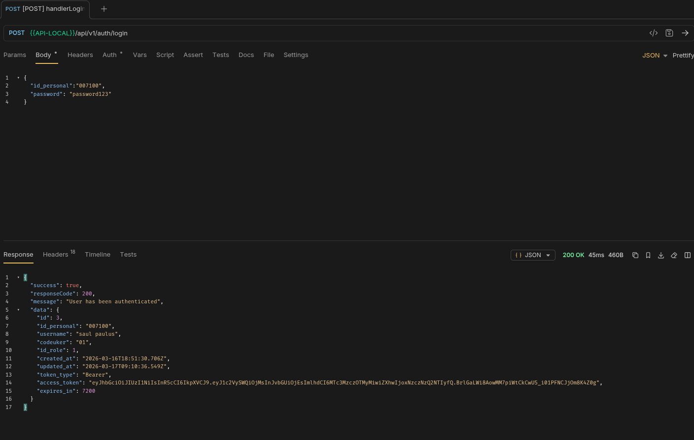
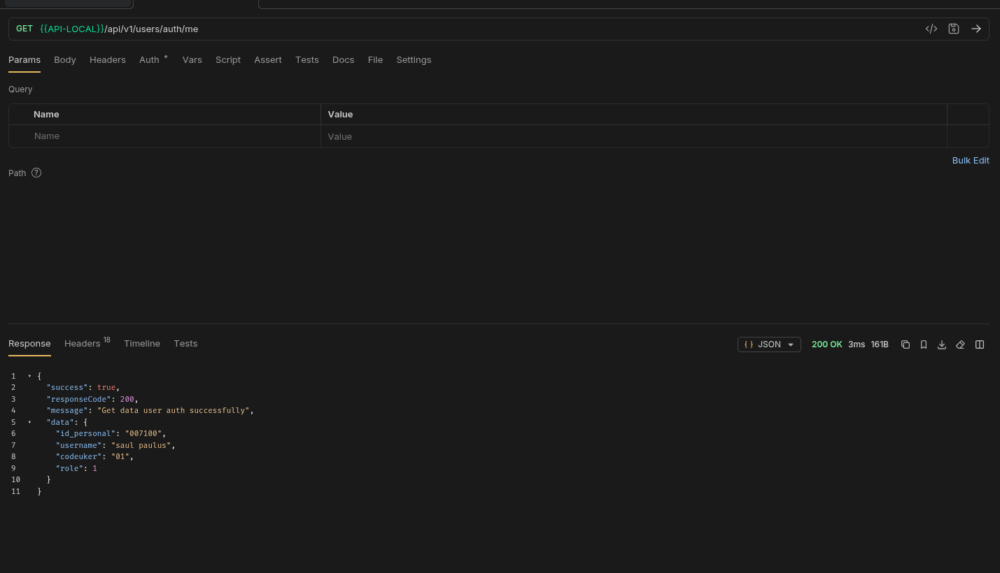

# Enterprise Express.js REST API Template

[](https://nodejs.org/en/)
[](https://expressjs.com/)
[](LICENSE)

A robust, enterprise-grade REST API backend template built with **Express.js** follow **Clean Architecture**. This template provides a highly scalable, maintainable, and testable foundation.

## 🏗 Architecture Overview

This project is meticulously designed around core architectural principles to ensure clean code and separation of concerns:

1. **Clean Architecture**: Separation of concerns into Domain, Application, Infrastructure, and Interface layers.
2. **Modular Architecture**: Features are encapsulated into isolated modules (e.g., User, Role, Auth).
3. **Dependency Injection (DI)**: Powered by [Awilix](https://github.com/jeffijoe/awilix) with **Auto-loading** capabilities.

---

## ✨ Key Features

- ✅ **Clean Architecture Design**: Strict layer boundaries.
- ✅ **Auto DI Container**: Automatic module registration using Awilix `loadModules`.
- ✅ **Unified JSON Response**: Consistent structure via `helpers.js`.
- ✅ **Global Error Handling**: Centralized mapping in `errorHandler.js`.
- ✅ **Path Aliases**: Uses `@/` for clean imports.
- ✅ **Prisma ORM**: Modern database access.
- ✅ **Security**: Helmet, CORS, and Bcrypt integrations.

---

## 📂 Folder Structure

```text
src/
├── modules/                # Bounded Contexts (Feature-based)
│   └── user/               # User Module
│       ├── domain/         # Layer 1: Entities & Repository Interfaces
│       │   ├── entities/   # User.js
│       │   └── repositories/ # UserRepository.js (Interface)
│       ├── application/    # Layer 2: Use Cases & DTOs
│       │   ├── usecases/   # CreateUserUseCase.js, GetUsersUseCase.js
│       │   └── dtos/       # user.public.dto.js
│       ├── infrastructure/ # Layer 3: External Implementations
│       │   ├── repositories/ # PrismaUserRepository.js
│       │   └── security/    # PasswordHasher.js
│       └── interfaces/     # Layer 4: Web Layer
│           ├── controllers/ # UserController.js
│           └── routes/      # user.routes.js
├── infrastructure/         # Global Frameworks & Drivers
│   ├── database/           # prisma.js, connection.js
│   ├── services/           # JwtService.js, EmailService.js
│   ├── cache/              # redis.js
│   └── queue/              # jobQueue.js
├── shared/                 # Cross-cutting concerns
│   ├── errors/             # ApiError.js
│   ├── middleware/         # errorHandler.js, authMiddleware.js
│   └── utils/              # helpers.js
├── config/                 # Configuration
│   ├── env.js              # Environment variables
│   └── logger.js           # Winston logger
├── container.js            # DI Container setup
├── app.js                  # Express app setup
└── server.js               # entry point
```

---

## 🔄 Request Lifecycle

```text
 Client Request -> Router -> Middleware -> Controller -> UseCase -> Repository -> Prisma -> DB
```

### 📖 Layer Descriptions

#### 1. Domain Layer (`modules/*/domain/`)
Pure business logic. Contains **Entities** and **Repository Interfaces**. No dependencies on external frameworks.

#### 2. Application Layer (`modules/*/application/`)
Orchestrates business flow. Contains **UseCases** (logic executors) and **DTOs**.

#### 3. Infrastructure Layer (`modules/*/infrastructure/`)
Technical implementations. Contains **Repository implementations**, **Specific Services**, and **Security helpers**.

#### 4. Interface Layer (`modules/*/interfaces/`)
The entry point for the module. Contains **Controllers** and **Routes**.

---

## 🚀 Adding a New Module

Follow this standard flow to add a new module (e.g., `role`):

### 1. Define Domain
Create `src/modules/role/domain/repositories/RoleRepository.js` (Interface).

### 2. Implement Repository
Create `src/modules/role/infrastructure/repositories/PrismaRoleRepository.js` implementing the interface.

### 3. Create Use Case
Create `src/modules/role/application/usecases/CreateRoleUseCase.js`. Inject `roleRepository` in constructor.

### 4. Create Controller
Create `src/modules/role/interfaces/controllers/RoleController.js`. Inject use cases.

### 5. Create Routes
Create `src/modules/role/interfaces/routes/role.routes.js`.

### 6. Register in App
Update `src/app.js` to register the new routes:
```javascript
app.use('/api/v1/roles', container.resolve('roleRoutes'));
```

### 7. Optional: Alias in Container
If you need specific aliases, update `src/container.js`. Otherwise, Awilix will auto-load them as camelCase (e.g., `createRoleUseCase`).

---

### 8. Tesing API
##### User Login With API


##### User Get Me, Autheticated successfully


## 📄 License

This project is open-source software licensed under the MIT License. [LICENSE](LICENSE)
